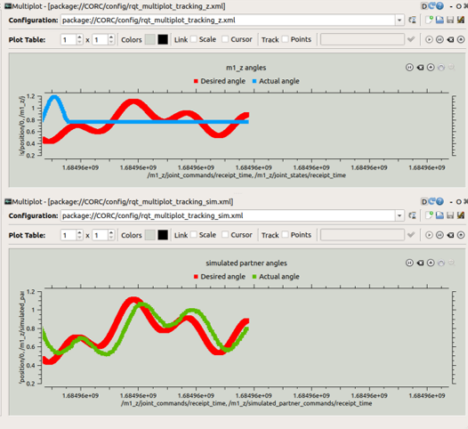
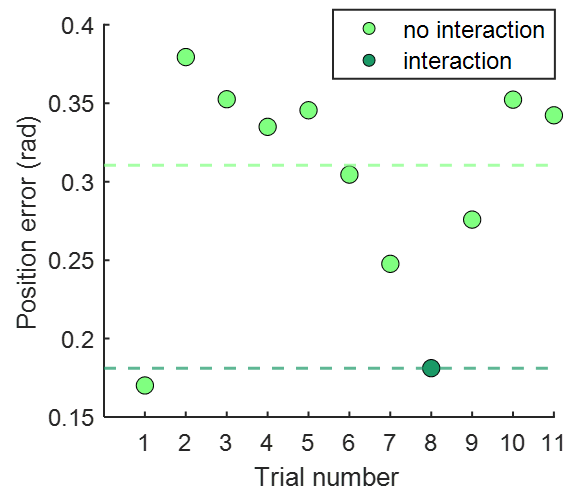

# (Day 3) Human-robot-human interaction

The M1-AnkleMotus is a commercial ankle rehabilitation robot developed by Fourier Intelligence (Singapore). We made some hardware modifications to bypass the default controller, allowing us to access the motor drive and torque sensor directly. This open source software stack (CORC) is used to control the ankle robot.

This README file gives instructions for testing out a paradigm of human-human physical interaction using the M1 robots. We provide details for using visual feedback during an ankle exercise with a simulated and real partner.

## Check git branch and build project

1. Open a terminal (ctrl + alt + T)
2. Make sure you are on the demo/ssnr2023 branch for both CANOpenRobotController and multi_robot_interaction

```bash
cd ~/catkin_ws/src
cd CANOpenRobotController
git checkout demo/ssnr2023

cd ~/catkin_ws/src
cd multi_robot_interaction
git checkout demo/ssnr2023
```
3. Build the CORC project and source the workspace
```bash
cd ~/catkin_ws
catkin build CORC
source devel/setup.bash
```

## (Simulation) Initialize CAN communication

1. Connect one of the M1 devices (m1_) to the operating computer via CAN USB cable
2. From a terminal, initialize CAN communication for a single device on can0 (enter password: *ssnr2023* when prompted)
```bash
cd ~/catkin_ws/src/CANOpenRobotController/script
sudo ./initCAN0.sh
```
3. Return to the project workspace
```bash
cd ~/catkin_ws
```

## (Simulation) Test interaction with a partner

<ins>Goal:</ins> to explore how haptic feedback from a simulated partner affects the "feel" of using the robot while performing ankle exercises

The haptic feedback implemented here is a spring which virtually connects your ankle to a simulated partner. Moving your ankle back and forth, you will experience attractive forces towards this simulated partner. Follow these instructions:

1. In the m1_params.yaml file (~/catkin_ws/src/CANOpenRobotController/config), make sure *config_flag* is set to false in order to disable sliders for adjusting PID gains and instead use previously configured values
2. Run ROS program for haptic collaboration from the same terminal window that the workspace was sourced
```bash
roslaunch CORC multi_m1_sim.launch
```
3. On the `/m1_x` panel of **Dynamic Reconfigure**, set *controller_mode* to *zero_calibration* and wait until calibration is complete
4. Set *controller_mode* to *virtual_spring*
5. Strap into the device while seated in a chair
6. Start the **Multiplot** display by pressing the play icon at the top right of each panel
   * The top subplot will display your instantaneous ankle angle
   * The bottom subplot will display the instananeous angle of a simulated partner



7. To display a target trajectory for an example ankle exercise while haptically connected to a simulated partner, set the experimental conditions in the `/multi_robot_interaction` panel of **Dynamic Reconfigure**
   * Adjust the *k_interaction* slider to change the stiffness parameter of the virtual spring
   * Set *trajectory_mode* to *multi_sine*
   * Set *experimental_cond* to *enable* (spring always on) or *alternate* (switch spring on and off each trial)
   * Set *interaction_mode* to *spring_collaboration_tracking_simulation* (starts the experiment)
   * Adjust the *f_1*, *f_2* and *f_3* sliders to change the frequency of the multi-sine; adjust *amp* to change the amplitude range
   * To change the performance of the simulated partner, adjust the *simulated_correlation* (phase shift from target) and *simulated_error* (scale magnitude) sliders
8. When finished, press ctrl + C to end the ROS program

## (Real) Initialize CAN communication

1. Connect two of the M1 devices (m1_x and m1_z) to the operating computer via CAN USB cables (multi-channel adapter)
2. From a terminal, initialize CAN communication for both devices (enter password: *ssnr2023* when prompted)
```bash
cd ~/catkin_ws/src/CANOpenRobotController/script
sudo ./initCAN0CAN1.sh
```
3. **Important!** Make sure m1_x is mapped to can0 and m1_z is mapped to can1
4. Return to the project workspace
```bash
cd ~/catkin_ws
```

## (Real) Test interaction with a partner

<ins>Goal:</ins> to explore how haptic feedback from a partner affects the "feel" of using the robot while performing ankle exercises

The haptic feedback implemented here is a spring which virtually connects two user's ankles. Moving your ankle back and forth, you will experience attractive forces towards your partner. Follow these instructions:

1. In the m1_params.yaml file (~/catkin_ws/src/CANOpenRobotController/config), make sure *config_flag* is set to false in order to disable sliders for adjusting PID gains and instead use previously configured values
2. Run ROS program for haptic collaboration from the same terminal window that the workspace was sourced
```bash
roslaunch CORC multi_m1_real.launch
```
3. On the `/m1_x` and `/m1_z` panels of **Dynamic Reconfigure**, set *controller_mode* to *zero_calibration* and wait until calibration is complete for each M1 robot
4. Set *controller_mode* to *virtual_spring* for each robot
5. Have 2 users strap into the device while seated in a chair
6. Start the **Multiplot** display by pressing the play icon at the top right of each panel
   * The top subplot will display one user's instantaneous ankle angle
   * The bottom subplot will display the other user's ankle angle
   * **Note:** you can drag and resize these **Multiplot** displays independently for each user by grabbing the top of each panel
7. To display a target trajectory for an example ankle exercise while the two users are haptically connected, set the experimental conditions in the `/multi_robot_interaction` panel of **Dynamic Reconfigure**
   * Adjust the *k_interaction* and *c_interaction* sliders to change the stiffness and damping parameters of the virtual spring (if you increase the stiffness, you should also increase the damping to maintain the performance of the system)
   * Set *trajectory_mode* to *multi_sine*
   * Set *experimental_cond* to *enable* (spring always on) or *alternate* (switch spring on and off each trial)
   * Set *interaction_mode* to *spring_collaboration_tracking* (starts the experiment)
   * Adjust the *f_1*, *f_2* and *f_3* sliders to change the frequency of the multi-sine; adjust *amp* to change the amplitude range
8. When finished, press ctrl + C to end the ROS program

## (Simulated or Real) Evaluate task performance and motor learning with and without haptic feedback

<ins>Goal:</ins> to quantify tracking performance while each group member performs ankle exercises with the robot under different haptic feedback conditions

As a group, you will design a simple experiment to evaluate how tracking performance changes while haptically connected to a partner (simulated or real). Your experiment could focus on how performance changes under different virtual stiffness conditions, or how the rate of learning changes when tracking with and without a partner. While group members are performing the exercise to collect data for evaluating the gains, the others can work on a data analysis pipeline (ideally in MATLAB with this function [m1_post_process.m](../../../matlab/m1_post_process.m)) to evaluate the group data. Follow these instructions:

1. As a group, decide on a simple experiment to evaluate performance and learning; experimental parameters include the number of trials/target frequencies as well as the order of transparent and haptic feedback conditions during ankle tracking (*spring_collaboration_tracking* or *spring_collaboration_tracking_simulation*)
      * Tracking performance can be evaluated using target and actual trajectories from M1 position data
      * Data from each M1 robot (interaction torque, desired and actual trajectories etc.) are continuously logged from when roslaunch is called, to when the program is ended (ctrl + C)
2. Repeat the steps associated with **Test interaction with a partner** (either real or simulated), according to the experiment you have planned
3. After collecting data on a number of group members, navigate to the log folder within ~\.ros\spdlogs and find the folder for your robot (m1_x or m1_z)
4. Transfer the .csv files associated with one or more previous runs (check timestamps) to a separate laptop
5. Using software of your choice (MATLAB, R studio, python), analyze the data from multiple runs to observe how tracking errors change depending on the haptic feedback conditions you tested
   * If using MATLAB, see [m1_post_process.m](../../../matlab/m1_post_process.m); this function will load a .csv file, segment it into trials (if the *interaction_mode* was set to *spring_collaboration_tracking* or *spring_collaboration_tracking_simulation*), and compute the root-mean-square error of the interaction torque measurements and tracking errors; it is suggested that you run this function in a loop to collect and analyze tracking errors across all group members
   * If not using MATLAB, key variables to look at in the .csv file would be the time (column name: time), mode (column name: mode), actual joint angle (column name: JointPositions_1) and desired joint angle (column name: MM1_DesiredJointPositions_1)


